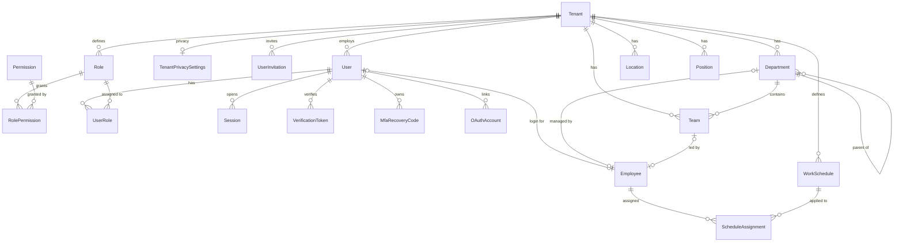
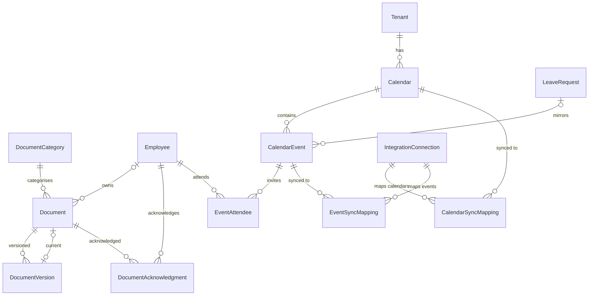

# Database schema (ERD)

PostgreSQL 18, 77 tables, UUID primary keys, `createdAt`/`updatedAt` timestamps,
soft deletes (`deletedAt`) where records must remain recoverable, foreign keys with explicit
delete behaviour, and indexes on every foreign key plus the columns used by list filters.

Every functional table carries `tenantId`; the API's tenant-scope extension injects it into
all queries (see ARCHITECTURE.md §3), so isolation does not depend on the caller.

## Core: tenancy, identity, organisation

## People

```mermaid
erDiagram
    Employee ||--o{ EmergencyContact : "has"
    Employee ||--o{ BankAccount : "paid into"
    Employee ||--o{ EmployeeEducation : "studied"
    Employee ||--o{ EmployeeSkill : "skilled in"
    Skill ||--o{ EmployeeSkill : "held by"
    Employee ||--o{ EmployeeLanguage : "speaks"
    Employee ||--o{ EmployeeNote : "annotated"
    Employee ||--o{ EmploymentHistory : "changed roles"
    Employee ||--o{ Contract : "employed by"
    Employee ||--o{ CompensationChange : "salary history"
    Employee ||--o{ Benefit : "receives"
    Employee ||--o{ LeaveBalance : "accrues"
    LeaveType ||--o{ LeaveBalance : "typed by"
    Employee ||--o{ LeaveRequest : "requests"
    LeaveType ||--o{ LeaveRequest : "typed by"
    LeaveRequest ||--o{ LeaveApproval : "approved in steps"
    Tenant ||--o{ Holiday : "observes"
    Tenant ||--o{ LeaveBlackoutDate : "blocks"
    Employee ||--o{ AttendanceEntry : "punches"
    AttendanceEntry ||--o{ AttendanceBreak : "breaks"
    Employee ||--o{ AttendanceCorrection : "corrects"
    AttendanceEntry |o--o{ AttendanceCorrection : "targets"
```

## Documents, calendar and integrations

## Performance, training, finance, operations

```mermaid
erDiagram
    ReviewCycle ||--o{ PerformanceReview : "contains"
    Employee ||--o{ PerformanceReview : "reviewed"
    Employee ||--o{ ReviewFeedback : "receives"
    Employee ||--o{ Goal : "owns"
    Goal ||--o{ KeyResult : "measured by"
    Goal |o--o{ Goal : "aligned to"
    Course ||--o{ TrainingAssignment : "assigned"
    Employee ||--o{ TrainingAssignment : "learns"
    Employee ||--o{ Certification : "holds"
    Course ||--o{ CourseSkill : "teaches"
    Skill ||--o{ CourseSkill : "covered"
    LearningPlan ||--o{ LearningPlanItem : "includes"
    Course ||--o{ LearningPlanItem : "included in"
    ExpenseCategory ||--o{ Expense : "categorises"
    Employee ||--o{ Expense : "claims"
    Asset ||--o{ AssetAssignment : "assigned"
    Employee ||--o{ AssetAssignment : "holds"
    Employee ||--o{ HRRequest : "raises"
    HRRequest ||--o{ HRRequestComment : "discussed"
    User ||--o{ Notification : "receives"
    User ||--o{ NotificationPreference : "configures"
    User ||--o{ PushDevice : "registers"
    Tenant ||--o{ AuditLog : "records"
    Tenant ||--o{ ConsentRecord : "consents"
    Tenant ||--o{ DataExportRequest : "exports"
    Tenant ||--o{ ErasureRequest : "erases"
    Tenant ||--o{ RetentionPolicy : "retains"
    Tenant ||--o{ SavedReport : "schedules"
    SavedReport ||--o{ ReportRun : "executed as"
```

## Model index

| Model | Fields | Key columns |
| --- | --- | --- |
| `Tenant` | 48 | id, name, slug, legalName, logoUrl, domain, status, plan, locale, timezone … |
| `TenantPrivacySettings` | 15 | id, tenantId, tenant, dpoName, dpoEmail, dataProcessingBasis, gpsTrackingEnabled, gpsConsentRequired, biometricEnabled, allowEmployeeExport … |
| `User` | 32 | id, tenantId, tenant, email, passwordHash, firstName, lastName, avatarUrl, phone, locale … |
| `UserInvitation` | 11 | id, tenantId, tenant, email, roleKeys, invitedById, tokenHash, expiresAt, acceptedAt, revokedAt … |
| `Role` | 12 | id, tenantId, tenant, key, name, description, isSystem, platformLevel, createdAt, updatedAt … |
| `Permission` | 6 | id, key, module, description, createdAt, roles |
| `RolePermission` | 4 | roleId, permissionId, role, permission |
| `UserRole` | 6 | userId, roleId, user, role, grantedById, grantedAt |
| `Session` | 13 | id, userId, user, refreshTokenHash, family, userAgent, ip, expiresAt, revokedAt, revokedReason … |
| `VerificationToken` | 8 | id, userId, user, type, tokenHash, expiresAt, usedAt, createdAt |
| `MfaRecoveryCode` | 6 | id, userId, user, codeHash, usedAt, createdAt |
| `OAuthAccount` | 12 | id, userId, user, provider, providerAccountId, email, accessTokenEnc, refreshTokenEnc, scopes, expiresAt … |
| `Department` | 18 | id, tenantId, tenant, name, code, description, parentId, parent, children, managerId … |
| `Location` | 18 | id, tenantId, tenant, name, address, city, country, timezone, latitude, longitude … |
| `Team` | 14 | id, tenantId, tenant, departmentId, department, name, description, leadId, lead, createdAt … |
| `Position` | 14 | id, tenantId, tenant, title, code, level, description, departmentId, department, createdAt … |
| `WorkSchedule` | 16 | id, tenantId, tenant, name, type, workDays, startTime, endTime, breakMinutes, flexibleMinutes … |
| `ScheduleAssignment` | 9 | id, tenantId, employeeId, employee, scheduleId, schedule, effectiveFrom, effectiveTo, createdAt |
| `Employee` | 76 | id, tenantId, tenant, userId, user, employeeNumber, firstName, lastName, preferredName, photoUrl … |
| `EmergencyContact` | 11 | id, tenantId, employeeId, employee, name, relationship, phone, email, isPrimary, createdAt … |
| `BankAccount` | 13 | id, tenantId, employeeId, employee, accountHolder, /**, ibanEnc, bic, bankName, currency … |
| `EmployeeEducation` | 12 | id, tenantId, employeeId, employee, institution, degree, fieldOfStudy, startYear, endYear, grade … |
| `Skill` | 9 | id, tenantId, tenant, name, category, createdAt, updatedAt, employees, courses |
| `EmployeeSkill` | 11 | id, tenantId, employeeId, employee, skillId, skill, level, yearsOfExp, lastUsedAt, createdAt … |
| `EmployeeLanguage` | 9 | id, tenantId, employeeId, employee, language, level, isNative, createdAt, updatedAt |
| `EmployeeNote` | 9 | id, tenantId, employeeId, employee, authorId, body, visibility, createdAt, updatedAt |
| `EmploymentHistory` | 13 | id, tenantId, employeeId, employee, departmentId, positionId, managerId, locationId, effectiveFrom, effectiveTo … |
| `Contract` | 26 | id, tenantId, tenant, employeeId, employee, type, status, number, startDate, endDate … |
| `CompensationChange` | 12 | id, tenantId, employeeId, employee, type, oldAmount, newAmount, currency, effectiveDate, reason … |
| `Benefit` | 15 | id, tenantId, employeeId, employee, type, name, provider, amount, currency, startDate … |
| `LeaveType` | 22 | id, tenantId, tenant, key, name, description, isPaid, requiresApproval, accrualType, defaultDaysPerYear … |
| `LeavePolicy` | 17 | id, tenantId, tenant, name, description, /**, approvalChain, /**, scope, minNoticeDays … |
| `LeaveBalance` | 15 | id, tenantId, employeeId, employee, leaveTypeId, leaveType, year, entitled, accrued, used … |
| `LeaveRequest` | 24 | id, tenantId, tenant, employeeId, employee, leaveTypeId, leaveType, startDate, endDate, startHalfDay … |
| `LeaveApproval` | 11 | id, tenantId, leaveRequestId, leaveRequest, stepOrder, approverType, approverId, status, comment, decidedAt … |
| `Holiday` | 10 | id, tenantId, tenant, name, date, isRecurringYearly, locationId, location, createdAt, updatedAt |
| `LeaveBlackoutDate` | 10 | id, tenantId, leaveTypeId, leaveType, name, startDate, endDate, reason, createdAt, updatedAt |
| `AttendanceEntry` | 25 | id, tenantId, employeeId, employee, date, clockIn, clockOut, breakMinutes, workedMinutes, overtimeMinutes … |
| `AttendanceBreak` | 8 | id, tenantId, attendanceEntryId, attendanceEntry, startedAt, endedAt, minutes, createdAt |
| `AttendanceCorrection` | 17 | id, tenantId, employeeId, employee, attendanceEntryId, attendanceEntry, date, requestedClockIn, requestedClockOut, requestedStatus … |
| `DocumentCategory` | 13 | id, tenantId, tenant, key, name, description, requiresAcknowledgement, requiresExpiry, defaultRetentionDays, isSystem … |
| `Document` | 28 | id, tenantId, tenant, employeeId, employee, categoryId, category, name, description, status … |
| `DocumentVersion` | 13 | id, tenantId, documentId, document, version, storageKey, fileName, mimeType, sizeBytes, checksum … |
| `DocumentAcknowledgment` | 10 | id, tenantId, documentId, document, versionId, employeeId, employee, acknowledgedAt, ip, signature |
| `Calendar` | 17 | id, tenantId, tenant, name, type, ownerEmployeeId, owner, departmentId, teamId, team … |
| `CalendarEvent` | 23 | id, tenantId, calendarId, calendar, title, description, type, startAt, endAt, allDay … |
| `EventAttendee` | 7 | id, tenantId, eventId, event, employeeId, employee, status |
| `IntegrationConnection` | 21 | id, tenantId, tenant, provider, /**, scopeKey, userId, status, externalAccountId, externalAccountEmail … |
| `CalendarSyncMapping` | 12 | id, tenantId, connectionId, connection, calendarId, calendar, externalCalendarId, syncToken, direction, lastSyncedAt … |
| `EventSyncMapping` | 12 | id, tenantId, connectionId, connection, eventId, event, externalEventId, etag, lastPushedAt, lastPulledAt … |
| `ReviewCycle` | 14 | id, tenantId, tenant, name, description, startDate, endDate, status, includesSelfReview, includesPeerReview … |
| `PerformanceReview` | 20 | id, tenantId, cycleId, cycle, employeeId, employee, reviewerId, reviewer, reviewerUserId, type … |
| `ReviewFeedback` | 14 | id, tenantId, reviewId, review, subjectEmployeeId, subjectEmployee, authorEmployeeId, authorEmployee, authorUserId, type … |
| `Goal` | 24 | id, tenantId, employeeId, employee, ownerUserId, title, description, type, parentId, parent … |
| `KeyResult` | 12 | id, tenantId, goalId, goal, title, targetValue, currentValue, unit, progress, dueDate … |
| `Course` | 18 | id, tenantId, tenant, title, description, provider, url, category, durationHours, isRequired … |
| `CourseSkill` | 4 | courseId, skillId, course, skill |
| `TrainingAssignment` | 18 | id, tenantId, employeeId, employee, courseId, course, status, assignedById, assignedAt, dueDate … |
| `Certification` | 14 | id, tenantId, employeeId, employee, name, issuer, issuedDate, expiresAt, status, documentId … |
| `LearningPlan` | 11 | id, tenantId, employeeId, employee, name, description, status, targetDate, createdAt, updatedAt … |
| `LearningPlanItem` | 9 | id, tenantId, learningPlanId, learningPlan, courseId, course, order, status, completedAt |
| `ExpenseCategory` | 12 | id, tenantId, tenant, key, name, description, requiresReceipt, maxAmount, isActive, createdAt … |
| `Expense` | 22 | id, tenantId, tenant, employeeId, employee, categoryId, category, title, description, amount … |
| `Asset` | 25 | id, tenantId, tenant, category, name, description, serialNumber, vendor, purchaseDate, purchaseCost … |
| `AssetAssignment` | 12 | id, tenantId, assetId, asset, employeeId, employee, assignedAt, returnedAt, conditionAtAssign, conditionAtReturn … |
| `HRRequest` | 17 | id, tenantId, tenant, employeeId, employee, type, subject, description, priority, status … |
| `HRRequestComment` | 8 | id, tenantId, requestId, request, authorUserId, body, isInternal, createdAt |
| `Notification` | 15 | id, tenantId, tenant, userId, user, type, title, body, channel, data … |
| `NotificationPreference` | 8 | id, tenantId, userId, user, eventType, channel, enabled, updatedAt |
| `PushDevice` | 9 | id, tenantId, userId, user, token, platform, deviceName, lastSeenAt, createdAt |
| `AuditLog` | 16 | id, tenantId, tenant, actorUserId, actorType, actorEmail, action, entityType, entityId, before … |
| `ConsentRecord` | 12 | id, tenantId, tenant, userId, employeeId, type, granted, version, grantedAt, revokedAt … |
| `DataExportRequest` | 13 | id, tenantId, subjectUserId, subjectEmployeeId, requestedById, status, format, fileDocumentId, fileDocument, completedAt … |
| `ErasureRequest` | 13 | id, tenantId, subjectEmployeeId, requestedById, status, method, reason, decidedById, decidedAt, completedAt … |
| `RetentionPolicy` | 10 | id, tenantId, tenant, dataType, retentionDays, action, isActive, updatedById, createdAt, updatedAt |
| `SavedReport` | 15 | id, tenantId, tenant, name, type, format, filters, scheduleFrequency, recipients, isActive … |
| `ReportRun` | 16 | id, tenantId, savedReportId, savedReport, type, format, status, filters, rowCount, fileDocumentId … |

## Enum index

| Enum | Values |
| --- | --- |
| `TenantStatus` | ACTIVE, TRIAL, SUSPENDED, CANCELLED |
| `TenantPlan` | FREE, STARTER, PROFESSIONAL, ENTERPRISE |
| `UserStatus` | INVITED, ACTIVE, SUSPENDED, DISABLED |
| `TokenType` | EMAIL_VERIFICATION, PASSWORD_RESET, INVITE |
| `OAuthProvider` | GOOGLE, MICROSOFT |
| `WorkScheduleType` | FIXED, FLEXIBLE, SHIFT, ROTATING, CUSTOM |
| `EmployeeStatus` | ACTIVE, PROBATION, ON_LEAVE, SUSPENDED, TERMINATED |
| `EmploymentType` | FULL_TIME, PART_TIME, CONTRACT, INTERN, TEMPORARY |
| `ContractType` | PERMANENT, FIXED_TERM, PROBATION, INTERNSHIP, CONTRACTOR |
| `Gender` | MALE, FEMALE, OTHER, UNDISCLOSED |
| `NoteVisibility` | HR_ONLY, MANAGER, PRIVATE |
| `ContractStatus` | DRAFT, ACTIVE, EXPIRED, TERMINATED |
| `CompensationChangeType` | BASE_SALARY, HOURLY_RATE, BONUS, ALLOWANCE, ADJUSTMENT |
| `BenefitType` | HEALTH_INSURANCE, LIFE_INSURANCE, PENSION, MEAL_VOUCHER, TRANSPORT, PHONE, CAR, GYM, EDUCATION, OTHER |
| `LeaveAccrualType` | ANNUAL_FIXED, MONTHLY_ACCRUAL, NONE |
| `LeaveRequestStatus` | DRAFT, PENDING, APPROVED, REJECTED, CANCELLED |
| `ApproverType` | MANAGER, HR, USER |
| `ApprovalStepStatus` | PENDING, APPROVED, REJECTED, SKIPPED |
| `AttendanceStatus` | PRESENT, LATE, ABSENT, HALF_DAY, REMOTE, LEAVE, HOLIDAY, WEEKEND |
| `PunchSource` | WEB, MOBILE, KIOSK, QR, GPS, IMPORT, MANUAL |
| `CorrectionStatus` | PENDING, APPROVED, REJECTED |
| `DocumentStatus` | ACTIVE, ARCHIVED, EXPIRED |
| `DocumentConfidentiality` | PUBLIC, INTERNAL, CONFIDENTIAL, RESTRICTED |
| `CalendarType` | COMPANY, DEPARTMENT, TEAM, PERSONAL, HOLIDAY |
| `CalendarEventType` | MEETING, EVENT, HOLIDAY, LEAVE, BUSINESS_TRIP, REMOTE_WORK, TRAINING, OTHER |
| `EventVisibility` | PUBLIC, TENANT, PRIVATE |
| `EventAttendeeStatus` | INVITED, ACCEPTED, DECLINED, TENTATIVE |
| `IntegrationProvider` | GOOGLE, MICROSOFT, SLACK, TEAMS, PAYROLL, ACCOUNTING, RECRUITMENT |
| `IntegrationStatus` | CONNECTED, DISCONNECTED, ERROR, SYNCING |
| `SyncDirection` | NONE, PULL, PUSH, BIDIRECTIONAL |
| `ReviewCycleStatus` | DRAFT, ACTIVE, CLOSED |
| `ReviewType` | SELF, MANAGER, PEER, UPWARD |
| `ReviewStatus` | PENDING, IN_PROGRESS, SUBMITTED, ACKNOWLEDGED |
| `FeedbackType` | COMMENT, PRAISE, CONCERN |
| `FeedbackVisibility` | HR_ONLY, MANAGER, EMPLOYEE, PUBLIC |
| `GoalType` | GOAL, OKR, KPI |
| `GoalStatus` | DRAFT, ACTIVE, ON_TRACK, AT_RISK, OFF_TRACK, COMPLETED, CANCELLED |
| `GoalPriority` | LOW, MEDIUM, HIGH, CRITICAL |
| `EnrollmentStatus` | ASSIGNED, IN_PROGRESS, COMPLETED, FAILED, CANCELLED |
| `CertificationStatus` | VALID, EXPIRING, EXPIRED, REVOKED |
| `LearningPlanStatus` | DRAFT, ACTIVE, COMPLETED, CANCELLED |
| `ExpenseStatus` | DRAFT, SUBMITTED, CHANGES_REQUESTED, APPROVED, REJECTED, REIMBURSED, CANCELLED |
| `AssetCategory` | LAPTOP, PHONE, MONITOR, CAR, ACCESS_CARD, EQUIPMENT, SOFTWARE_LICENSE, OTHER |
| `AssetStatus` | AVAILABLE, ASSIGNED, IN_REPAIR, RETIRED, LOST |
| `AssetCondition` | NEW, GOOD, FAIR, POOR, DAMAGED |
| `HRRequestType` | HR, CERTIFICATE, DOCUMENT, PAYROLL, EQUIPMENT, REMOTE_WORK, IT, OTHER |
| `HRRequestStatus` | OPEN, IN_PROGRESS, WAITING_EMPLOYEE, RESOLVED, CLOSED, CANCELLED |
| `HRRequestPriority` | LOW, NORMAL, HIGH, URGENT |
| `NotificationChannel` | IN_APP, EMAIL, PUSH, SMS |
| `ActorType` | USER, SYSTEM, API, INTEGRATION |
| `ConsentType` | DATA_PROCESSING, MARKETING, PRIVACY_POLICY, GPS_TRACKING, BIOMETRIC |
| `DataRequestStatus` | REQUESTED, PROCESSING, COMPLETED, FAILED, REJECTED |
| `ErasureMethod` | ANONYMIZE, DELETE |
| `RetentionAction` | DELETE, ANONYMIZE, ARCHIVE |
| `ReportType` | EMPLOYEES, HEADCOUNT, TURNOVER, ABSENCE, LEAVE, ATTENDANCE, OVERTIME, SALARY, DEPARTMENT, HIRING, TERMINATION, DEMOGRAPHICS |
| `ReportFormat` | CSV, XLSX, PDF, JSON |
| `ScheduledFrequency` | DAILY, WEEKLY, MONTHLY, QUARTERLY |
| `ReportRunStatus` | QUEUED, RUNNING, COMPLETED, FAILED |

## Constraints worth knowing

- **Uniqueness** — `User(tenantId, email)`, `Employee(tenantId, employeeNumber)`,
  `Employee(tenantId, workEmail)`, `AttendanceEntry(tenantId, employeeId, date)`,
  `LeaveBalance(tenantId, employeeId, leaveTypeId, year)`,
  `EventSyncMapping(connectionId, externalEventId)`, `EventSyncMapping(connectionId, eventId)`,
  `CalendarSyncMapping(connectionId, externalCalendarId)`, `DocumentVersion(documentId, version)`,
  `DocumentAcknowledgment(documentId, employeeId)`, `IntegrationConnection(tenantId, provider, scopeKey)`.
- **Money** — `Decimal(12,2)` with an ISO-4217 `currency` column on every monetary record.
- **Calendar days** — `@db.Date` for leave, attendance, contracts and expiry fields so a
  timezone shift can never move a day.
- **Encrypted columns** — fields suffixed `Enc` (`Employee.nationalIdEnc`, `BankAccount.ibanEnc`,
  `User.mfaSecretEnc`, `IntegrationConnection.accessTokenEnc`, `OAuthAccount.refreshTokenEnc`)
  hold AES-256-GCM ciphertext.
- **Immutability** — `AuditLog` has no `updatedAt` and is never updated or deleted by the API.
- **Recommended hardening** (see [SECURITY.md](./SECURITY.md)): add `pg_trgm` GIN indexes on
  the searchable name/email columns and enable row-level security for regulated deployments.
